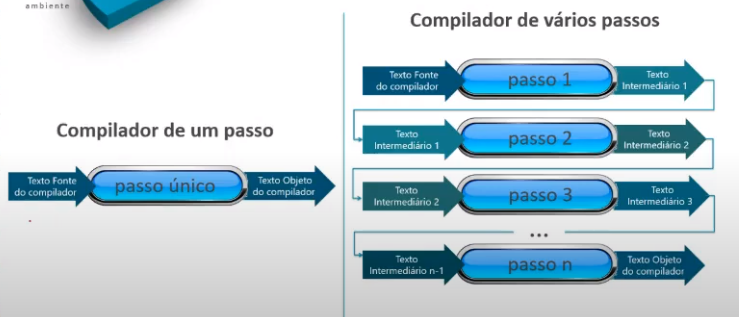

# **Construção de Compiladores**

## Metas

Definir metas de uso do compilador

- Qual será a finalidade com compilador?
- Quem será seu usuário típico?
- Velocidade no tempo de compilação ou velocidade no tempo de execução?
- Mensagem de erro devem ser claras?
- Mais velocidade para o programa ou menos ocupação em memória?
- Não é possível criar um compilador perfeito em tudo (_tradeoff_)

 

## Passos

Definir a quantidade de passos de compilação que o compilador vai ter

**Passo de compilação:** Um passo de compilação é definido pela quantidade de vezes que o compilador lê o texto fonte por inteiro, ou algum texto fonte intermediário

### Vantagens de compiladores de muitos passos

- Menor utilização de mémoria do compilador
- Maior possibilidade de executar otimizações
- Projetos e implementações mais independentes

### Vantagens de compiladores de poucos passos

- Menor volume de entrada e saída
- Redução do tempo de compilação
- Redução da complexidade do projeto total

### Técnica de BackPatching

Durante a compilação, itens ainda não conhecidos pelo compilador são substiuídos por lacunas, que serão preenchidas quando os itens forem encontrados

**Obs.:** Esse retorno não configura novos passos na compilação

 

## Blocos

Definir a quantidade de blocos de código que o compilador vai ter

**Bloco de código:** Um bloco de código é definido pela quantidade de arquivos que o compilador vai gerar no fim de sua compilação. Esses blocos serão executados apenas quando for necessário.

Separar o código em vários arquivos é útil para reduzir o consumo de memória, pois as dlls só serão executadas caso for necessário.

 

## Esquemas

Definir qual o esquema de implementação que vai ser usado

- Esquema de implementação é a decisão sobre como cada parte do processo de compilação (Léxico, Sintático e Semantico) vão se comunicar entre si para formar o compilador

A parte principal geralmente é a que tem mais código (a parte mais volumosa do compilador)

### Programa princial: analisador sintático (mais usado)

Esquema de implementação em que o analisador sintático é o mais importante dentre as 3 partes

### Programa princial: analisador léxico

Esquema de implementação em que o analisador léxico é o mais importante dentre as 3 partes

### Programa princial: analisador semântico / gerador de código

Esquema de implementação em que o analisador semântico e o gerador de código são os mais importantes dentre as 3 partes

### Co-rotinas

Representa uma iteração "_infinita_". Cada trecho de código roda independente num processador ou numa máquina diferente. Todos os trechos repetem permanentemente a tarefa a que se destinam.

 

## Linguagens

Definir as linguagens fonte e objeto que serão tratadas pelo compilador

// TODO

 

## Ambiente

Definir a plataforma e a linguagem de programação que será usada para desenvolver o compilador

// TODO
