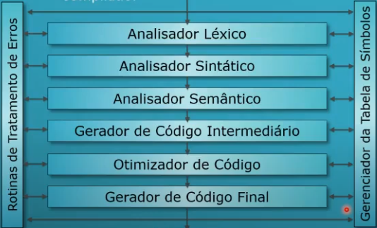

# **Funcionamento de um Compilador**

## **Modelo análise síntese**

Enxerga todo o trabalho do compilador dividido em dois grandes blocos de atividade:

- **[Análise](./funcionamento-de-um-compilador#analise)** (Analisador Léxico, Analisador Sintático, Analisador Semântico)
- **[Síntese](./funcionamento-de-um-compilador#sintese)** (Gerador de Código Intermediário, Otimizador de Código e Gerador de Código Final)



<br/>

## **Análise**

- Quebra o programa fonte em suas partes constituintes
- Cria uma representação intermediária equivalente ao programa fonte
- As operações realizadas pelo programa fonte e os elementos utilizados são identificados
- Grava estas informações numa estrutura hierárquica (árvore sintática estendida)

### **Analisador Léxico**

Identifica os átomos do texto fonte

- Faz análise do texto fonte
- Varre todo o texto fonte da esquerda para a direita
- Agrupa caracteres em átomos (tokens)
- Checa com padrões determinados de formação dos átomos
- Classifica átomos identificados nos tipos de átomos possíveis
- Identifica palavras reservadas da linguagem
- Monta registros iniciais na tabela de símbolos
- Utiliza construções não recursivas

### **Analisador Sintático**

Verifica sequência correta de átomos

- Faz análise hierárquica do texto fonte
- Agrupa os átomos em frases gramáticas
- Trabalha sobre regras da linguagem (definidas em gramáticas formais)
- Pode conter regras recursivas
- Representa as frases gramaticais em uma árvore
- Exemplo de verificação de sequências ou regras: balanceamento de parênteses

### **Analisador Semântico**

Verifica coerência de significados

- Pode alterar conteúdo da árvore sintática montada
- Tarefa importante é a checagem de tipo
- Efetua ou não conversões de tipo (depende da definição da linguagem)
- Pode eliminar ineficiência na estrutura

<br/>

## **Síntese**

- Constrói o programa objeto a partir da representação intermediária do bloco de análise
- Requer técnicas mais especializadas

**Sub-partes:** Gerador de Código Intermediário, Otimizador de código e Gerador de Código Final

### **Gerador de Código Intermediário**

Traduz para lógica de formato de máquina

- Gera representação numa terceira linguagem
- Gera programa para execução em máquina abstrata, fictícia
- Deve gerar código que seja fácil de produzir e, ao mesmo tempo, fácil de traduzir
- Existem vários tipos de representação usados
- O código deve ser indenpendente de máquina

### **Otimizador de Código**

Melhora código intermediário gerado

- Elimina redundâncias
- Reduz ineficiências
- Torna o código mais simples e mais rápido
- Diminui o número de instruções
- Existe grande variedade de tipos de otimização
- Há classe de compiladores com ênfase nesta fase

### **Gerador de Código Final**

Gera o código final resultado da compilação

- Compõe-se de código de máquina relocável ou assembly nos casos mais comuns
- Como alternativa pode gerar códigos em linguagem de alto nível nos casos de transpiladores, filtros ou preprocessadores
- Nos casos mais comuns as instruções em código intermediário são traduzidas emde instruções em linguagem de montagem
- Aspecto crítico: uso de registradores de cada arquitetura de máquina

<br/>

## **Módulos Globais**

### **Rotinas de tratamento de Erros**

Controla a ocorrência de erros

- Tenta descrever a falha encontrada em uma das partes do compilador
- Tenta recuperar o erro encontrado (tenta continuar a análise do programa)
- Em cada parte do trabalho do compilador serão descritos os vários erros
- Pode ser uma rotina independente ou diluída

### **Gerenciador da Tabela de Símbolos**

Gerencia o repositório tabela de símbolos

- Estrutura de dados global
- Módulo de código e a própria estrutura de dados
- Grava identificadores e símbolos que foram encontrados no programa fonte
- Armazena informações sobre vários atributos destes símbolos
- Exemplos de atributos: localização de memória, tipo da variável, escopo da variável, numero e tipo dos parâmetros das rotinas, etc.
- É utilizada por todas as outras partes

## **Exemplo**

Suponha a sentença `pos = 8 + 5 * tempo`. Após ser submetido ao *analisador léxico*, é preenchida a tabela de símbolos (mediado pelo *gerenciador da tabela de símbolos*):

|  ID |  Átomo  |       Tipo      | Identificador |
| :-: | :-----: | :-------------: | :-----------: |
|  1  |  `pos`  |    `inteiro`    |     `id1`     |
|  2  |   `=`   |   `atribuição`  |      `sa`     |
|  3  |   `8`   |    `inteiro`    |     `co1`     |
|  4  |   `+`   |      `soma`     |      `ss`     |
|  5  |   `5`   |    `inteiro`    |     `co2`     |
|  6  |   `*`   | `multiplicação` |      `sm`     |
|  7  | `tempo` |      `real`     |     `id2`     |

Preenchida a tabela, a árvore sintática é gerada pelo *analisador sintático*

```
    sa
   /  \
id1    ss
      /  \
   co1    sm
         /  \
      co2    id2
```

O *analisador semântico* verifica os tipos requeridos pelas operações e altera a árvore de forma a respeitar esses tipos

```
    sa
   /  \
id1    ss
      /  \
    ir    sm
    |    /  \
   co1  ir   id2
        |
       co2
```

Finaliza a etapa de análise, o *gerador de código intermediário* realiza o processo de síntese do código

```
aux1 = int_to_real(co2)
aux2 = aux1 * id2
aux3 = int_to_real(co1)
aux4 = aux3 + aux2
id1 = aux4
```
O *otimizador de código* recebe o código intermediário e realiza o processo de otimização

```
aux1 = 5.0 * id2
id1 = 8.0 + aux1
```

...to be continue
