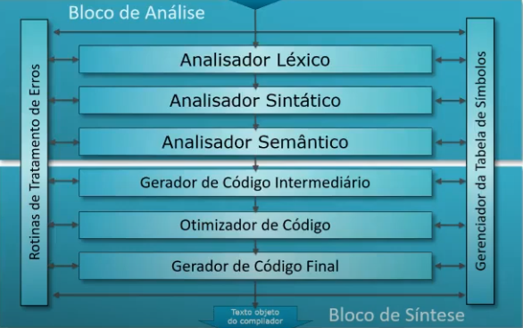

# **Modelo Análise / Síntese**

Separa com base na atividade.

Enxerga todo o trabalho do compilador dividido em dois grandes blocos de atividade:

- **[Análise](/conceitos-basicos/funcionamento-de-um-compilador/analise-sintese#análise)** (Analisador Léxico, Analisador Sintático, Analisador Semântico)
- **[Síntese](/conceitos-basicos/funcionamento-de-um-compilador/analise-sintese#síntese)** (Gerador de Código Intermediário, Otimizador de Código e Gerador de Código Final)

 

## **Análise**

- Quebra o programa fonte em suas partes constituintes
- Cria uma representação intermediária equivalente ao programa fonte
- As operações realizadas pelo programa fonte e os elementos utilizados são identificados
- Grava estas informações numa estrutura hierárquica (árvore sintática estendida)

  **Sub-partes:** Analisador léxico, Analisador Sintático e Analisador Semântico

 

## **Síntese**

- Constrói o programa objeto a partir da representação intermediária do bloco de análise
- Requer técnicas mais especializadas

  **Sub-partes:** Gerador de Código Intermediário, Otimizador de código e Gerador de Código Final
