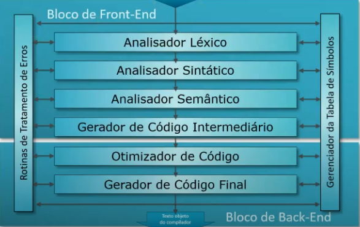

# **Modelo _front-end_ / _back-end_**

Separa com base da dependência.

Enxerga todo o trabalho do compilador dividido em dois grandes blocos de atividade:

**Utilidade:** Quando esses 2 blocos são independentes entre si, é possível criar diversos compiladores com pouco esforço. Se a linguagem fonte mudar, cria-se um _front-end_ novo. Se a plataforma mudar, Cria-se um _back-end_ novo. Ou seja, se eu tenho 3 _front-ends_ e 4 _back-ends_, podemos montar 3\*4 = 12 compiladores diferentes.

 

## **_Front-end_**

- Partes/subpartes do compilador dependentes da linguagem fonte
- É totalmente independente da máquina objeto

  **Sub-partes:** Análise Léxica, análise sintática, análise semântica, geração de código intermediário, parte da rotina de tratamento de erro e parte da tabela de símbolos

 

## **_Back-end_**

- Partes/subpartes do compilador dependentes da máquina objeto
- Não dependem da linguagem fonte

  **Sub-partes:** Otimizador de Código, Gerador de Código Final, Rotinas de tratamento de Erros e Gerenciador da Tabela de Símbolos
