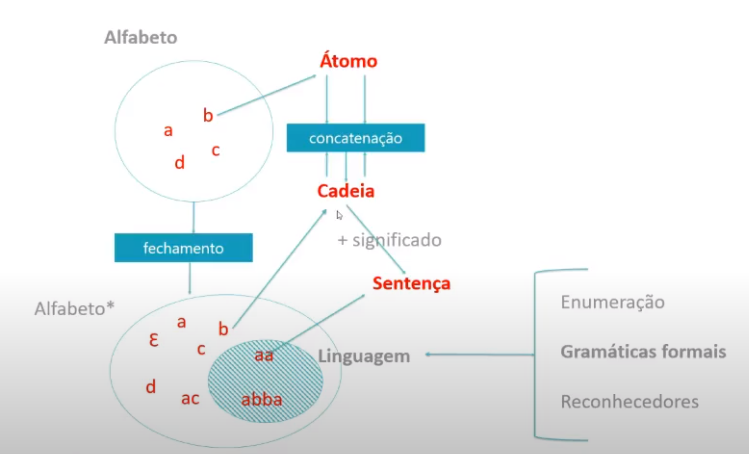

# Gramáticas Formais



## Formalização de Gramáticas

Uma gramática é uma quádrupla ordena `G = (V, Σ, P, S)`, sendo:

- `V` vocabulário
- `Σ` alfabeto
- `P` produções gramaticais
- `S` símbolo inicial

### Vocabulário `V`

Conjunto de todos os elementos simbólicos utilizados para definir as leis de formação da gramática

- Contém todos os elementos terminais e não terminais necessários para descrever a gramática

### Alfabeto `Σ`

Conjunto de todos os elementos simbólicos utilizados para definir as sentenças da linguagem

- É o conjunto dos símbolos terminais
- **Obs.:** Todos os símbolos que `V` tem que `Σ` não tem compõem o conjunto dos não-terminais `N`, que não é declarado imperativamente, mas sim deduzido.

### Produções Gramaticais `P`

Conjunto das leis de formação de sentenças

- Principal conjunto da gramática
- Os elementos deste conjunto são chamados de `leis de formação` ou `produções gramaticais`
- **Formato:** `α -> β`
  - cadeia `α` gera cadeia `β`
  - `α ∊ V*.N.V*`: `α` precisa ter ao menos 1 elemento não terminal
  - `β ∊ V*`: `β` precisa ter ao menos 1 elemento não terminal

### Símbolo Inicial `S`

Símbolo que inicia todo o processo de produção de sentenças da linguagem.
- `S ∊ V`: Pertence ao vocabulário `V`

## Processo de Derivação

- Sempre é iniciado pelo símbolo inicial da gramática `S`
- Obedecendo as leis de formação, tenta-se chegar à cadeia em questão. Se for possível, então a cadeia é sentença
- A linguagem é o conjunto de todas as sentenças possíveis de serem formadas pelas leis de formação

## Construção de Gramáticas Formais

- Uma gramática formal completa e bem formada define uma linguagem
- Uma gramática define apenas uma linguagem
- Uma linguagem pode ser definida por mais de uma gramática formal

Quando uma gramática define uma linguagem

- Uma linguagem é um conjunto de sentenças
- Para uma gramática definir uma linguagem as duas afirmações abaixo devem ser verdadeiras:
  - Toda sentença gerada pelas regras da gramática faz parte do conjunto de sentenças da linguagem
  - Toda sentença do conjunto da linguagem deve poder ser gerada pelas regras da gramática

### Notação de expressões regulares

Define a forma geral de todas as sentenças de uma linguagem

- `x+`: Um símbolo x deve aparecer pelo menos uma vez
- `x*`: Um símbolo x deve aparecer zero ou mais vezes
- `x|y`: Indica uma alternativa entre o símbolo x ou y
- `()`: Agrupa cadeias a serem trabalhadas 

## Exemplo

gramática que descreve `(xy)+|zx*`
```
G = (V, Σ, P, S)
V = { S, A, B, x, y, z }
Σ = { x, y, z }
P = {
  S -> xyA,
  S -> zB,
  A -> xyA,
  A -> ε,
  B -> xB,
  B -> ε
}

L = { xy, xyxy, xyxyxy, ..., z, zx, zxx, zxxx, ... }
```