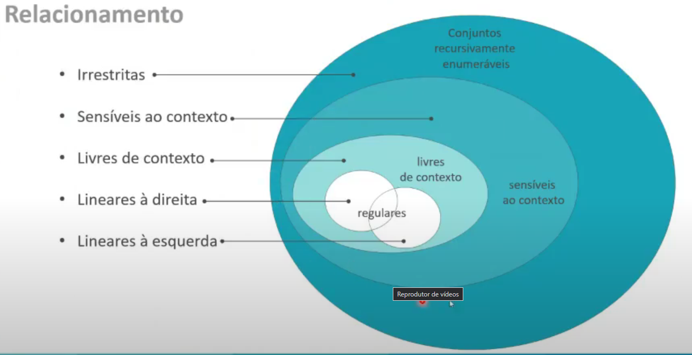

# Hierarquia de Chomsky

Chomsky estabeleceu critérios que classificam as linguagens quanto a sua restrição.
- Quanto mais interno o nível, mais restrito.
- Toda linguagem pertencente a uma classe obedece todas as regras anteriores.

| Classes de Gramáticas | Tipo |
|:---------------------:|:----:|
| Irrestritas           |  0   |
| Sensíveis ao Contexto |  1   |
| Livres de Contexto    |  2   |
| Lineares à direita    |  3   |
| Lineares à esquerda   |  3   |

## Relacionamento entre as classes da gramática

- As gramáticas lineares são do mesmo tipo(nível).
- As gramáticas de um nível mais alto também são classificadas como de níveis anteriores.

## Irrestritas (Recursivamente Enumeráveis)

Basta que obedeça a regra padrão das gramáticas:
- `α -> β` `α ∊ V*.N.V*` `β ∊ V*`
```
G = (
  { A, b, c },
  { b, c },
  {
    A -> AA,
    AA -> b, // produção que impede a gramática de ser mais restrita
    A -> cc,
    A -> ε
  },
  A
)
```

## Sensíveis ao Contexto

Além das restrições acima, precisa obedecer o seguinte:
- `α -> β` `|α| <= |β|`: Uma produção não pode diminuir o tamanho da proxima cadeia
```
G = (
  { A, B, b, c },
  { b, c },
  {
    A -> AB,
    AB -> Ab, // produção que impede a gramática de ser mais restrita
    B -> Acc,
    A -> b
  },
  A
)
```

## Livres de Contexto

Além das restrições acima, precisa obedecer o seguinte:
- `α -> β` `α ∊ N`: `α` é apenas 1 elemento não terminal. Não é possível mais gerar algo a partir de uma composição de 2 não terminais
```
G = (
  { A, B, b, c },
  { b, c },
  {
    A -> AB, // produção que impede a gramática de ser mais restrita
    A -> Ab,
    B -> Acc,
    A -> b
  },
  A
)
```

## Lineares à Direita

Além das restrições acima, precisa obedecer o seguinte:
- `α -> β` `β = δπ` `δ ∊ Σ*` `π ∊ N ou π = ε`: As produções só podem ir gerando derivações para direita, ou seja, se houver algum não terminal gerado, este deve estar no final da cadeia
```
G = (
  { A, B, b, c },
  { b, c },
  {
    A -> bB,
    A -> bA,
    B -> ccA,
    A -> bcc
  },
  A
)
```

## Lineares à Esquerda

Além das restrições acima, precisa obedecer o seguinte:
- `α -> β` `β = πδ` `δ ∊ Σ*` `π ∊ N ou π = ε`: As produções só podem ir gerando derivações para esquerda, ou seja, se houver algum não terminal gerado, este deve estar no início da cadeia
```
G = (
  { A, B, b, c },
  { b, c },
  {
    A -> Bb,
    A -> Ab,
    B -> Acc,
    A -> bcc
  },
  A
)
```