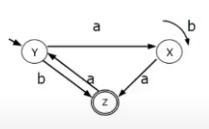
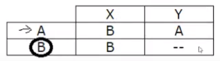

# Notações

Formas de descrever e construir autômatos finitos (AFs)

## Formalismo Matemático

Define os 5 elementos necessários ao AF como como conjuntos e elementos relacionados em uma quíntupla ordenada.

```
M = (Q, Σ, P, A, F)
Q = { A, B, C }
Σ = { 0, 1 }
P = {
  (A, 0) → A,
  (A, 1) → B,
  (B, 0) → C,
  (B, 1) → A,
  (C, 0) → B,
  (C, 1) → A
}
F = { A, C }
```

## Diagrama de Estados

- Notação gráfica para construção de AFs
- Simbologia usada:
  - **Estado X**: Representado por um X dentro de um círculo
  - **Estado inicial Y**: Representado por um estado qualquer com uma seta vinda de lugar nenhum e apontanda para ele
  - **Estado final de aceitação Z**: Representado por um Z dentro de 2 círculos concêntricos
  - **Transição entre estados X e Y (com átomo n consumido na transição)**: Representado por uma seta vinda do estado X até o estado Y, com o átomo n no meio da seta.



## Tabelas de Transição

- Notação tabular para construção de AFs
- Matriz onde as linhas são os estados e os símbolos são as colunas
- Simbologia usada:
  - **Estado X**: Representado por um X na ponta esquerda das linhas da tabela
  - **Estado inicial Y**: Representado por um estado qualquer com uma seta vinda de lugar nenhum e apontanda para ele
  - **Estado final de aceitação Z**: Representado por um estado Z circulado
  - **Transição entre estados X e Y (com átomo n consumido na transição)**: Representado por um cruzamento da linha X com a coluna n. A célula do cruzamento é Y


